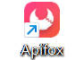
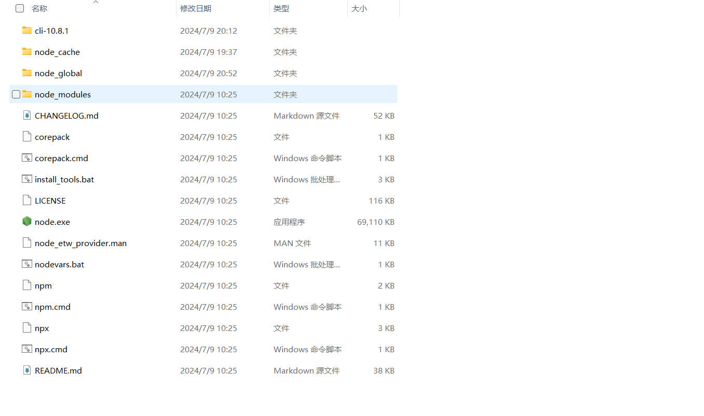
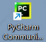

# 安装APIFox并熟悉
- 在官网下载
  

- 尝试看了一下官方视频，太多专有名词不知道，所以没看懂
# 安装nodejs
- 从网上看视频下载并配置的
>此处放上视频链接【Node.js安装及环境变量配置】 https://www.bilibili.com/video/BV19F411t7zX/?share_source=copy_web&vd_source=a669273ffab7141fc6c7dd9e85221328
 
### 安装和配置过程出现的一些问题
- 在下载nodejs的时候，我下了最新版，但是听说可能会不兼容，我又删了
- 第二次下，下的太旧了，听说没办法安装vue，我又删了
- 第三次，下好了，结果在配置vue时，说我的npm版本太旧，没办法下，。。。。。，我又重新更新一下npm，结果又是镜像网站失效，环境变量出错，把我气了一晚上
- 最后应该是都配置好了，我也不知道它会不会再次出错

# vscode安装配置
- vscode我已经用了很久了，有点不记得自己怎么安装配置了,我大概写一下
- 先去官网下载安装包
- 然后下一些与前端相关的插件，基本上就完成了
  

# jetbrains的安装配置
- 由于我上个学期就开始用jetbrans的pycharm，所以我也有点忘记我怎么配置的了
- 方正也是去官网下pycharm，由于我是个菜鸡所以只需要下pycharm的社区版就可以了
- 然后去微软商店下一个版本还算新的python
- 最后把解释器设置成python，就可以写python了
> 其实vscode也可以写python，也只需要把解释器设置成python就可以了

